# 轻营 LingMart · 架构与流程图集

> 本文用 Mermaid 描述「轻营（LingMart）」C2C 交易平台的系统结构、依赖关系、业务状态机与关键链路时序。
> 在 VS Code 中打开 Markdown 预览（内置支持或安装 Markdown Preview Mermaid Support）即可看到图形。
> 所有内容与当前代码一致（v0.11 已逐图与源码核对一遍：接口路径、方法名、队列名、状态机、定时任务周期、阈值）；
> 代码变更时请同步更新本文件。

**目录**

1. [系统总体架构](#1-系统总体架构)
2. [部署与容器拓扑](#2-部署与容器拓扑)
3. [服务依赖关系（Feign / MQ / Seata）](#3-服务依赖关系feign--mq--seata)
4. [一次外部请求的处理时序（鉴权与路由）](#4-一次外部请求的处理时序鉴权与路由)
5. [角色与权限模型](#5-角色与权限模型)
6. [开店入驻流程](#6-开店入驻流程)
7. [店铺状态机](#7-店铺状态机)
8. [商品生命周期与 ES 索引](#8-商品生命周期与-es-索引)
9. [交易主链路时序（下单 → 支付 → 扣减）](#9-交易主链路时序下单--支付--扣减)
10. [订单状态机](#10-订单状态机)
11. [库存状态机与补偿](#11-库存状态机与补偿)
12. [ES 写一致性兜底流程](#12-es-写一致性兜底流程)
13. [订单超时关单（双保险）](#13-订单超时关单双保险)
14. [聊天链路时序（STOMP）](#14-聊天链路时序stomp)
15. [Agent 浮窗链路时序（SSE）](#15-agent-浮窗链路时序sse)
16. [数据库 ER 关系](#16-数据库-er-关系)

---

## 1. 系统总体架构

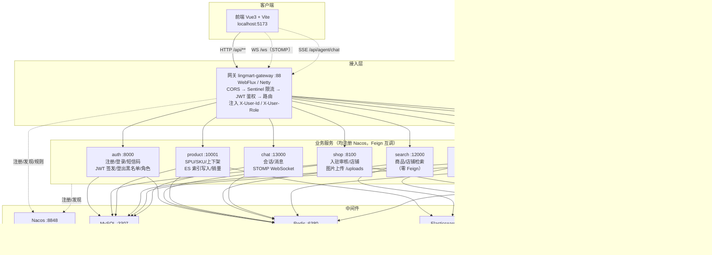
```mermaid
flowchart TB
    subgraph CLIENT["客户端"]
        FE["前端 Vue3 + Vite<br/>localhost:5173"]
    end

    subgraph EDGE["接入层"]
        GW["网关 lingmart-gateway :88<br/>WebFlux / Netty<br/>CORS → Sentinel 限流 → JWT 鉴权 → 路由<br/>注入 X-User-Id / X-User-Role"]
    end

    subgraph SVC["业务服务（均注册 Nacos，Feign 互调）"]
        AUTH["auth :8000<br/>注册/登录/短信码<br/>JWT 签发/登出黑名单/角色"]
        SHOP["shop :8100<br/>入驻审核/店铺<br/>图片上传 /uploads"]
        PRODUCT["product :10001<br/>SPU/SKU/上下架<br/>ES 索引写入/销量"]
        ORDER["order :9000<br/>下单/支付/取消<br/>退款/超时关单/Outbox"]
        WARE["ware :11000<br/>预锁/扣减/解锁<br/>库存流水与补偿"]
        SEARCH["search :12000<br/>商品/店铺检索<br/>（零 Feign）"]
        CHAT["chat :13000<br/>会话/消息<br/>STOMP WebSocket"]
        AGENT["agent :14000<br/>浮窗 Copilot<br/>RAG + 操作意图 SSE"]
    end

    subgraph MW["中间件"]
        NACOS["Nacos :8848<br/>注册/发现 + 共享配置<br/>+ Sentinel 规则"]
        MYSQL["MySQL :3307<br/>6 套独立业务库"]
        REDIS["Redis :6380<br/>黑名单/限流/缓存/会话"]
        ES["Elasticsearch :9201<br/>索引 lingmart_product"]
        MQ["RabbitMQ :5672<br/>支付事件/超时延迟"]
        SEATA["Seata TC :8091<br/>分布式事务协调"]
        CHROMA["ChromaDB :18000<br/>知识库向量库"]
    end

    FE -->|"HTTP /api/**"| GW
    FE -.->|"WS /ws（STOMP）"| GW
    FE -.->|"SSE /api/agent/chat"| GW

    GW --> AUTH
    GW --> SHOP
    GW --> PRODUCT
    GW --> ORDER
    GW --> WARE
    GW --> SEARCH
    GW --> CHAT
    GW --> AGENT

    AUTH --> MYSQL
    AUTH --> REDIS
    SHOP --> MYSQL
    SHOP --> REDIS
    SHOP --> SEATA
    PRODUCT --> MYSQL
    PRODUCT --> ES
    PRODUCT --> REDIS
    ORDER --> MYSQL
    ORDER --> MQ
    ORDER --> SEATA
    WARE --> MYSQL
    WARE --> MQ
    WARE --> SEATA
    SEARCH --> ES
    SEARCH --> REDIS
    CHAT --> MYSQL
    CHAT --> REDIS
    AGENT --> REDIS
    AGENT --> CHROMA
    GW --> REDIS

    SVC -.->|"注册/发现"| NACOS
    GW -.->|"注册/发现/规则"| NACOS
```

---

## 2. 部署与容器拓扑

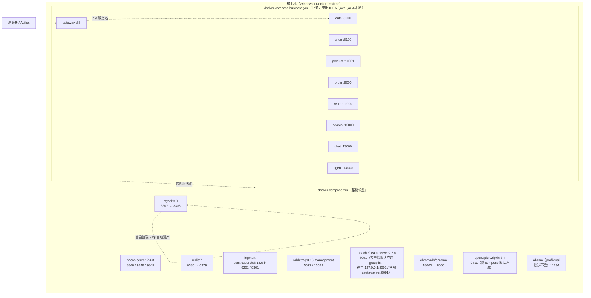
```mermaid
flowchart LR
    subgraph HOST["宿主机（Windows / Docker Desktop）"]
        subgraph INFRA["docker-compose.yml（基础设施）"]
            NACOS["nacos-server 2.4.3<br/>8848 / 9848 / 9849"]
            MYSQL["mysql:8.0<br/>3307 → 3306"]
            REDIS["redis:7<br/>6380 → 6379"]
            ES["lingmart-elasticsearch:8.15.5-ik<br/>9201 / 9301"]
            MQ["rabbitmq:3.13-management<br/>5672 / 15672"]
            SEATA["apache/seata-server:2.5.0<br/>8091（客户端默认直连 grouplist：<br/>宿主 127.0.0.1:8091 / 容器 seata-server:8091）"]
            CHROMA["chromadb/chroma<br/>18000 → 8000"]
            ZIPKIN["openzipkin/zipkin 3.4<br/>9411（随 compose 默认启动）"]
            OLLAMA["ollama（profile=ai<br/>默认不启）11434"]
        end

        subgraph BIZ["docker-compose.business.yml（业务，或用 IDEA / java -jar 本机跑）"]
            BGW["gateway :88"]
            BAUTH["auth :8000"]
            BSHOP["shop :8100"]
            BPROD["product :10001"]
            BORDER["order :9000"]
            BWARE["ware :11000"]
            BSEARCH["search :12000"]
            BCHAT["chat :13000"]
            BAGENT["agent :14000"]
        end

        MYSQL -.->|"首启挂载 ./sql 自动建库"| MYSQL
    end

    BGW -.->|"lb:// 服务名"| BAUTH
    BIZ -.->|"内网服务名"| INFRA
    USER["浏览器 / Apifox"] --> BGW
```

> 说明：`docker-compose.yml`（中间件）与 `docker-compose.business.yml`（9 个业务服务）叠加使用；
> 业务容器端口与 `java -jar` 本机启动一致，不可同时占用。启动顺序：
> `mvn -DskipTests clean package` → `scripts/push-nacos-config.sh` → 起中间件 → 起业务服务。
> 其中 zipkin 随 compose 默认启动、`ZIPKIN_ENABLED` 默认 true；chroma 亦随 compose 启动（仅 agent 使用）。

---

## 3. 服务依赖关系（Feign / MQ / Seata）

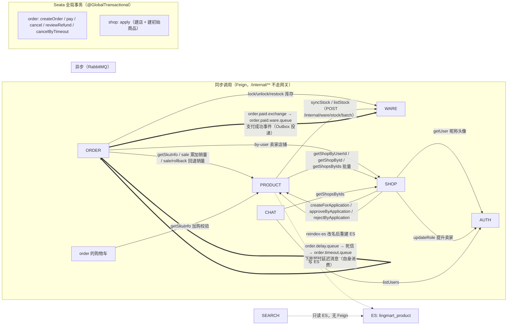
```mermaid
flowchart LR
    subgraph 同步Feign["同步调用（Feign，/internal/** 不走网关）"]
        ORDER -->|"lock/unlock/restock 库存"| WARE
        ORDER -->|"getSkuInfo / sale 累加销量 / sale/rollback 回退销量"| PRODUCT
        ORDER -->|"by-user 卖家店铺"| SHOP
        SHOP -->|"createForApplication / approveByApplication / rejectByApplication"| PRODUCT
        SHOP -->|"reindex-es 改名后重建 ES"| PRODUCT
        SHOP -->|"getUser 昵称头像"| AUTH
        SHOP -->|"updateRole 提升卖家"| AUTH
        PRODUCT -->|"getShopByUserId / getShopById / getShopsByIds 批量"| SHOP
        PRODUCT -->|"syncStock / listStock（POST /internal/ware/stock/batch）"| WARE
        CHAT -->|"getShopsByIds"| SHOP
        CHAT -->|"listUsers"| AUTH
        CART["order 的购物车"] -->|"getSkuInfo 加购校验"| PRODUCT
    end

    subgraph 异步MQ["异步（RabbitMQ）"]
        ORDER ==>|"order.paid.exchange → order.paid.ware.queue<br/>支付成功事件（Outbox 投递）"| WARE
        ORDER ==>|"order.delay.queue → 死信 → order.timeout.queue<br/>下单超时延迟消息（自身消费）"| ORDER
    end

    subgraph 全局事务["Seata 全局事务（@GlobalTransactional）"]
        GT1["order: createOrder / pay / cancel / reviewRefund / cancelByTimeout"]
        GT2["shop: apply（建店 + 建初始商品）"]
    end

    SEARCH -.->|"只读 ES，无 Feign"| ESIDX["ES: lingmart_product"]
    PRODUCT -.->|"写 ES"| ESIDX
```

---

## 4. 一次外部请求的处理时序（鉴权与路由）

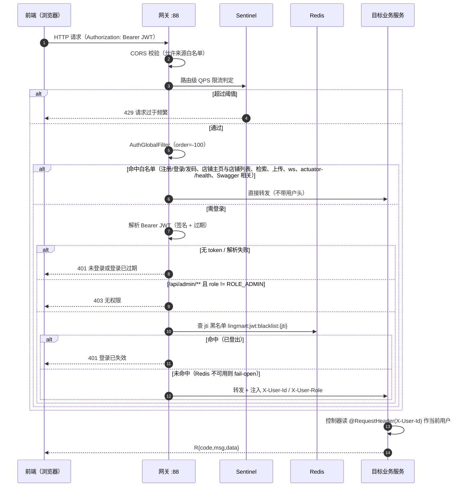
```mermaid
sequenceDiagram
    autonumber
    participant FE as 前端（浏览器）
    participant GW as 网关 :88
    participant SENT as Sentinel
    participant RD as Redis
    participant SVC as 目标业务服务

    FE->>GW: HTTP 请求（Authorization: Bearer JWT）
    GW->>GW: CORS 校验（允许来源白名单）
    GW->>SENT: 路由级 QPS 限流判定
    alt 超过阈值
        SENT-->>FE: 429 请求过于频繁
    else 通过
        GW->>GW: AuthGlobalFilter（order=-100）
        alt 命中白名单（注册/登录/发码、店铺主页与店铺列表、检索、上传、ws、actuator/health、Swagger 相关）
            GW->>SVC: 直接转发（不带用户头）
        else 需登录
            GW->>GW: 解析 Bearer JWT（签名 + 过期）
            alt 无 token / 解析失败
                GW-->>FE: 401 未登录或登录已过期
            else /api/admin/** 且 role != ROLE_ADMIN
                GW-->>FE: 403 无权限
            else
                GW->>RD: 查 jti 黑名单 lingmart:jwt:blacklist:{jti}
                alt 命中（已登出）
                    GW-->>FE: 401 登录已失效
                else 未命中（Redis 不可用则 fail-open）
                    GW->>SVC: 转发 + 注入 X-User-Id / X-User-Role
                end
            end
        end
    end
    SVC->>SVC: 控制器读 @RequestHeader(X-User-Id) 作当前用户
    SVC-->>FE: R{code,msg,data}
```

---

## 5. 角色与权限模型

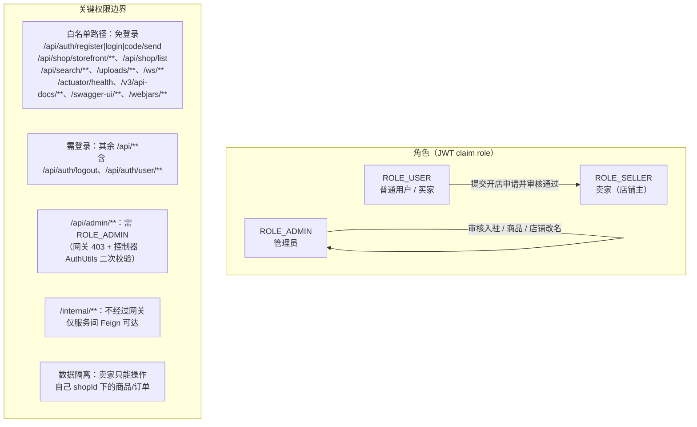
```mermaid
flowchart TB
    subgraph ROLES["角色（JWT claim role）"]
        U["ROLE_USER<br/>普通用户 / 买家"]
        S["ROLE_SELLER<br/>卖家（店铺主）"]
        A["ROLE_ADMIN<br/>管理员"]
    end

    U -->|"提交开店申请并审核通过"| S
    A -->|"审核入驻 / 商品 / 店铺改名"| A

    subgraph PERM["关键权限边界"]
        P1["白名单路径：免登录<br/>/api/auth/register|login|code/send<br/>/api/shop/storefront/**、/api/shop/list<br/>/api/search/**、/uploads/**、/ws/**<br/>/actuator/health、/v3/api-docs/**、/swagger-ui/**、/webjars/**"]
        P2["需登录：其余 /api/**<br/>含 /api/auth/logout、/api/auth/user/**"]
        P3["/api/admin/**：需 ROLE_ADMIN<br/>（网关 403 + 控制器 AuthUtils 二次校验）"]
        P4["/internal/**：不经过网关<br/>仅服务间 Feign 可达"]
        P5["数据隔离：卖家只能操作<br/>自己 shopId 下的商品/订单"]
    end
```

> 角色变更写进 JWT，**需重新登录才生效**；shop 审核通过会经 Feign 提升 ROLE_SELLER，
> 另有 `RolePromotionRetryScheduler` 周期补偿漏提升的店主。

---

## 6. 开店入驻流程

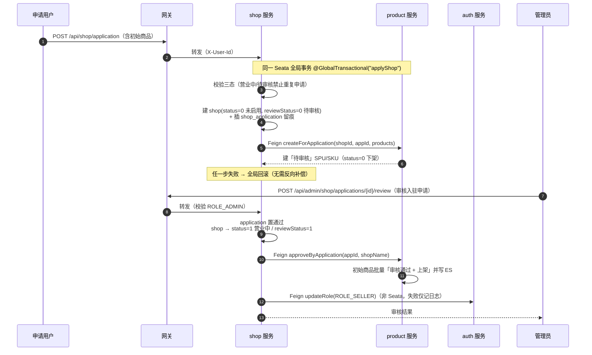
```mermaid
sequenceDiagram
    autonumber
    participant B as 申请用户
    participant GW as 网关
    participant SHOP as shop 服务
    participant PROD as product 服务
    participant AUTH as auth 服务
    participant ADM as 管理员

    B->>GW: POST /api/shop/application（含初始商品）
    GW->>SHOP: 转发（X-User-Id）
    Note over SHOP,PROD: 同一 Seata 全局事务 @GlobalTransactional("applyShop")
    SHOP->>SHOP: 校验三态（营业中/待审核禁止重复申请）
    SHOP->>SHOP: 建 shop(status=0 未启用, reviewStatus=0 待审核)<br/>+ 插 shop_application 留痕
    SHOP->>PROD: Feign createForApplication(shopId, appId, products)
    PROD-->>SHOP: 建「待审核」SPU/SKU（status=0 下架）
    Note over SHOP: 任一步失败 → 全局回滚（无需反向补偿）

    ADM->>GW: POST /api/admin/shop/applications/{id}/review（审核入驻申请）
    GW->>SHOP: 转发（校验 ROLE_ADMIN）
    SHOP->>SHOP: application 置通过<br/>shop → status=1 营业中 / reviewStatus=1
    SHOP->>PROD: Feign approveByApplication(appId, shopName)
    PROD->>PROD: 初始商品批量「审核通过 + 上架」并写 ES
    SHOP->>AUTH: Feign updateRole(ROLE_SELLER)（非 Seata，失败仅记日志）
    SHOP-->>ADM: 审核结果
```

---

## 7. 店铺状态机

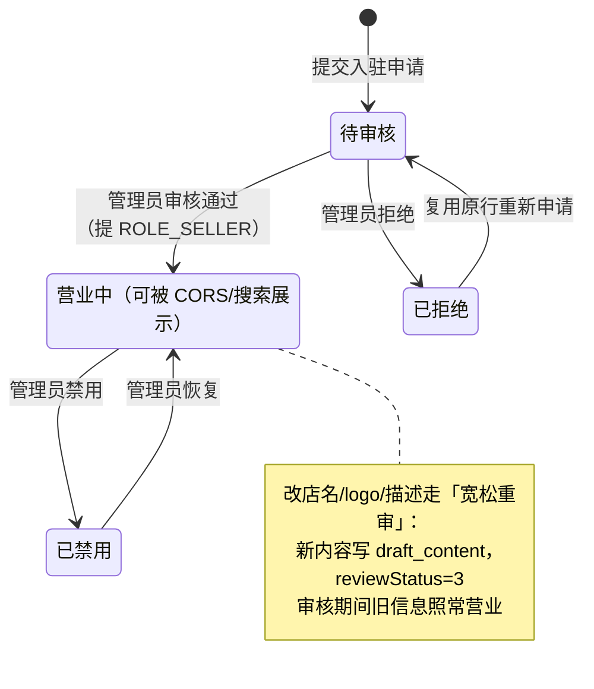
```mermaid
stateDiagram-v2
    [*] --> 待审核: 提交入驻申请
    待审核 --> 营业中: 管理员审核通过<br/>（提 ROLE_SELLER）
    待审核 --> 已拒绝: 管理员拒绝
    已拒绝 --> 待审核: 复用原行重新申请

    state "营业中（可被 CORS/搜索展示）" as 营业中
    state "已禁用" as 已禁用
    营业中 --> 已禁用: 管理员禁用
    已禁用 --> 营业中: 管理员恢复

    note right of 营业中
        改店名/logo/描述走「宽松重审」：
        新内容写 draft_content，reviewStatus=3
        审核期间旧信息照常营业
    end note
```

---

## 8. 商品生命周期与 ES 索引

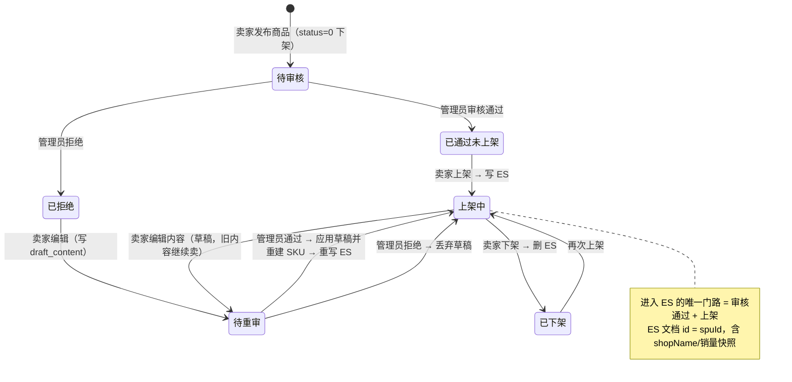
```mermaid
stateDiagram-v2
    [*] --> 待审核: 卖家发布商品（status=0 下架）
    待审核 --> 已通过未上架: 管理员审核通过
    待审核 --> 已拒绝: 管理员拒绝
    已拒绝 --> 待重审: 卖家编辑（写 draft_content）
    已通过未上架 --> 上架中: 卖家上架 → 写 ES
    上架中 --> 已下架: 卖家下架 → 删 ES
    已下架 --> 上架中: 再次上架
    上架中 --> 待重审: 卖家编辑内容（草稿，旧内容继续卖）
    待重审 --> 上架中: 管理员通过 → 应用草稿并重建 SKU → 重写 ES
    待重审 --> 上架中: 管理员拒绝 → 丢弃草稿

    note right of 上架中
        进入 ES 的唯一门路 = 审核通过 + 上架
        ES 文档 id = spuId，含 shopName/销量快照
    end note
```

**对浏览者的可见性门控**

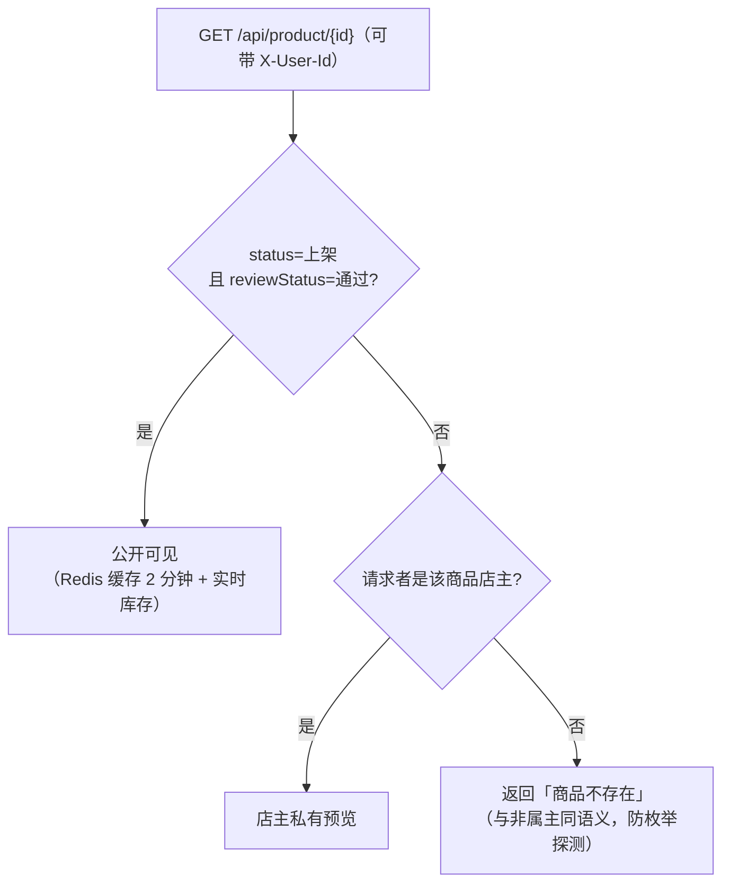
```mermaid
flowchart TB
    REQ["GET /api/product/{id}（可带 X-User-Id）"] --> CHK{"status=上架<br/>且 reviewStatus=通过?"}
    CHK -->|是| PUB["公开可见<br/>（Redis 缓存 2 分钟 + 实时库存）"]
    CHK -->|否| OWN{"请求者是该商品店主?"}
    OWN -->|是| PREVIEW["店主私有预览"]
    OWN -->|否| NF["返回「商品不存在」<br/>（与非属主同语义，防枚举探测）"]
```

---

## 9. 交易主链路时序（下单 → 支付 → 扣减）

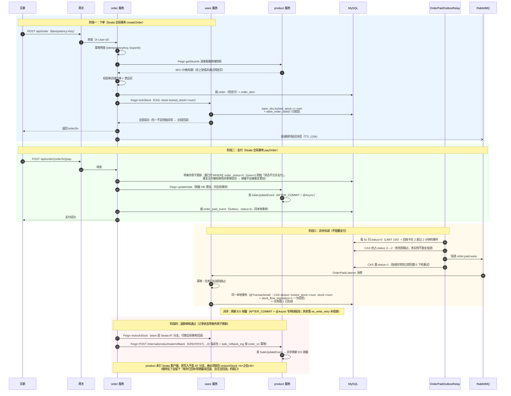
```mermaid
sequenceDiagram
    autonumber
    participant B as 买家
    participant GW as 网关
    participant O as order 服务
    participant W as ware 服务
    participant P as product 服务
    participant DB as MySQL
    participant RL as OrderPaidOutboxRelay
    participant MQ as RabbitMQ

    rect rgb(235, 245, 255)
    Note over B,W: 阶段一：下单（Seata 全局事务 createOrder）
    B->>GW: POST /api/order（Idempotency-Key）
    GW->>O: 转发（X-User-Id）
    O->>O: 幂等预查 (idempotencyKey, buyerId)
    O->>P: Feign getSkuInfo 逐条取服务端快照
    P-->>O: SKU 价格/标题（非上架或非通过则拒买）
    O->>O: 校验单店铺订单 + 禁自买
    O->>DB: 插 order（待支付）+ order_item
    O->>W: Feign lockStock（CAS: stock-locked_stock>=num）
    W->>DB: ware_sku.locked_stock += num<br/>+ ware_order_task(0 已锁定)
    W-->>O: 全部成功（任一不足则抛异常 → 全局回滚）
    O-->>B: 返回 orderSn
    O--)MQ: 投递超时延迟消息（TTL 120s）
    end

    rect rgb(240, 255, 240)
    Note over B,MQ: 阶段二：支付（Seata 全局事务 payOrder）
    B->>GW: POST /api/order/{orderSn}/pay
    GW->>O: 转发
    O->>DB: 带条件原子更新：置已付 WHERE order_status=0（rows=0 则抛「状态不允许支付」，<br/>重复支付被拒绝而非幂等成功 → 销量不会被重复累加）
    O->>P: Feign updateSale（销量 DB 累加，同全局事务）
    P->>P: 发 SaleUpdateEvent（AFTER_COMMIT + @Async）
    O->>DB: 插 order_paid_event（Outbox，status=0，同本地事务）
    O-->>B: 支付成功
    end

    rect rgb(255, 250, 235)
    Note over RL,W: 阶段三：异步扣减（不阻塞支付）
    RL->>DB: 每 5s 扫 status=0（LIMIT 100）+ 回收卡在 2 超过 2 分钟的事件
    RL->>DB: CAS 抢占 status: 0→2（失败即跳过，多实例不重复投递）
    RL->>MQ: 投递 order.paid.ware
    RL->>DB: CAS 置 status=1（投递异常则立即回置 0 下轮重试）
    MQ->>W: OrderPaidListener 消费
    W->>W: 幂等：任务已扣减则跳过
    W->>DB: 同一本地事务（@Transactional）：CAS deduct: locked_stock-=num, stock-=num<br/>+ stock_flow_log(status=1 一次成型)<br/>+ 任务置 1 已扣减
    end

    Note over P: 异步：刷新 ES 销量（AFTER_COMMIT + @Async 专用线程池；失败落 es_write_retry 补偿表）

    rect rgb(255, 245, 245)
    Note over O,P: 阶段四：退款审核通过（订单状态带条件原子更新）<br/>
    O->>W: Feign restockStock（ware 是 Seata AT 分支，可随全局事务回滚）
    O->>P: Feign POST /internal/product/sale/rollback（GREATEST(...,0) 保非负 + sale_rollback_log 按 order_sn 幂等）
    P->>P: 发 SaleUpdateEvent → 异步刷新 ES 销量
    Note over O,P: product 未引 Seata 客户端、其写入不是 AT 分支，故必须排在 restockStock <b>之后</b><br/>（顺序反了会留下「库存已回补而销量未回退、且无法回滚」的窗口）
    end
```

---

## 10. 订单状态机

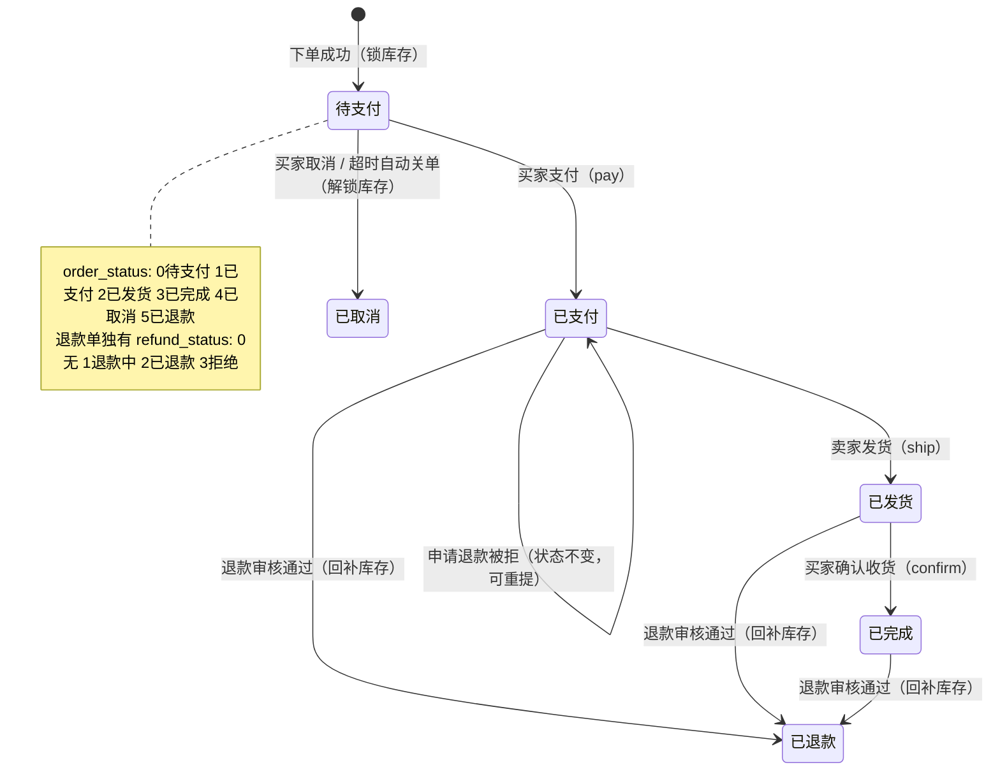
```mermaid
stateDiagram-v2
    [*] --> 待支付: 下单成功（锁库存）
    待支付 --> 已支付: 买家支付（pay）
    待支付 --> 已取消: 买家取消 / 超时自动关单<br/>（解锁库存）
    已支付 --> 已发货: 卖家发货（ship）
    已发货 --> 已完成: 买家确认收货（confirm）
    已支付 --> 已退款: 退款审核通过（回补库存）
    已发货 --> 已退款: 退款审核通过（回补库存）
    已完成 --> 已退款: 退款审核通过（回补库存）
    已支付 --> 已支付: 申请退款被拒（状态不变，可重提）

    note right of 待支付
        order_status: 0待支付 1已支付 2已发货 3已完成 4已取消 5已退款
        退款单独有 refund_status: 0无 1退款中 2已退款 3拒绝
    end note
```

---

## 11. 库存状态机与补偿

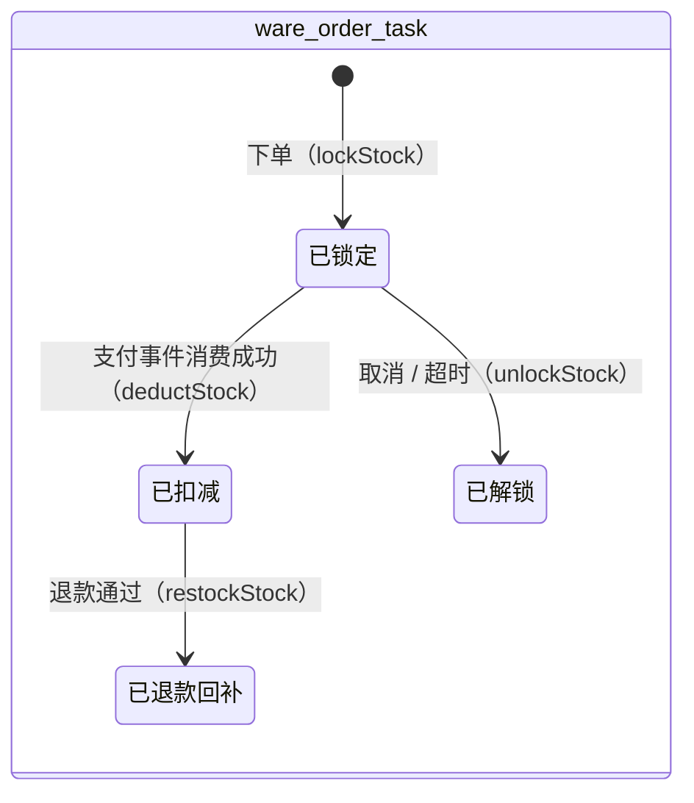
```mermaid
stateDiagram-v2
    state "ware_order_task" as T {
        [*] --> 已锁定: 下单（lockStock）
        已锁定 --> 已扣减: 支付事件消费成功（deductStock）
        已锁定 --> 已解锁: 取消 / 超时（unlockStock）
        已扣减 --> 已退款回补: 退款通过（restockStock）
    }
```

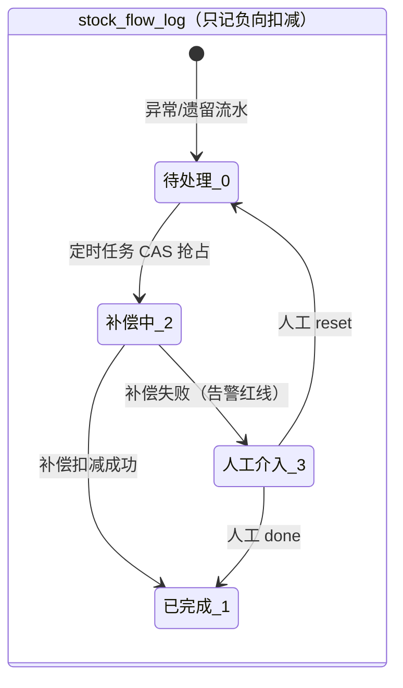
```mermaid
stateDiagram-v2
    state "stock_flow_log（只记负向扣减）" as F {
        [*] --> 待处理_0: 异常/遗留流水
        待处理_0 --> 补偿中_2: 定时任务 CAS 抢占
        补偿中_2 --> 已完成_1: 补偿扣减成功
        补偿中_2 --> 人工介入_3: 补偿失败（告警红线）
        人工介入_3 --> 待处理_0: 人工 reset
        人工介入_3 --> 已完成_1: 人工 done
    }
```

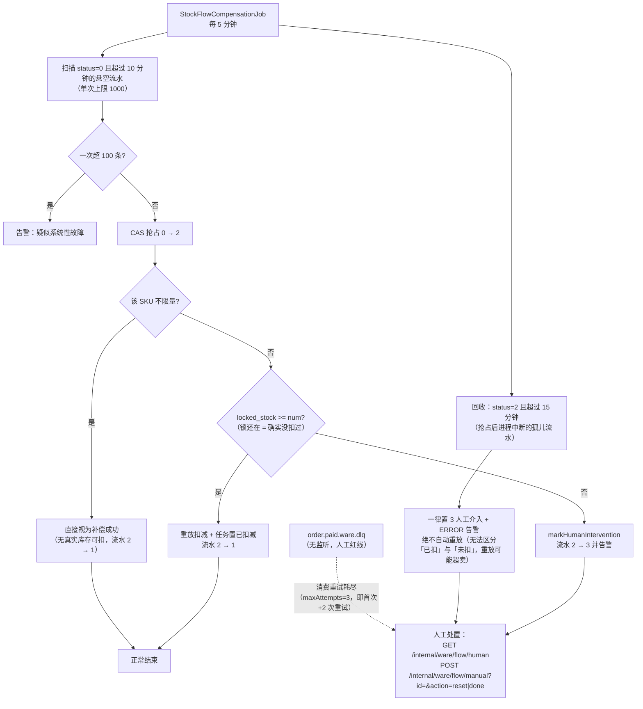
```mermaid
flowchart TB
    JOB["StockFlowCompensationJob<br/>每 5 分钟"] --> STUCK["回收：status=2 且超过 15 分钟<br/>（抢占后进程中断的孤儿流水）"]
    STUCK --> HUMAN0["一律置 3 人工介入 + ERROR 告警<br/>绝不自动重放（无法区分「已扣」与「未扣」，重放可能超卖）"]
    JOB --> SCAN["扫描 status=0 且超过 10 分钟的悬空流水<br/>（单次上限 1000）"]
    SCAN --> ALERT{"一次超 100 条?"}
    ALERT -->|是| WARN["告警：疑似系统性故障"]
    ALERT -->|否| CAS["CAS 抢占 0 → 2"]
    CAS --> UNL{"该 SKU 不限量?"}
    UNL -->|是| DED2["直接视为补偿成功<br/>（无真实库存可扣，流水 2 → 1）"]
    UNL -->|否| CHK{"locked_stock >= num?<br/>（锁还在 = 确实没扣过）"}
    CHK -->|是| DED["重放扣减 + 任务置已扣减<br/>流水 2 → 1"]
    CHK -->|否| HUMAN["markHumanIntervention<br/>流水 2 → 3 并告警"]
    DED --> DONE["正常结束"]
    DED2 --> DONE
    HUMAN --> API["人工处置：<br/>GET /internal/ware/flow/human<br/>POST /internal/ware/flow/manual?id=&action=reset|done"]
    HUMAN0 --> API

    DLQ["order.paid.ware.dlq<br/>（无监听，人工红线）"] -.->|"消费重试耗尽（maxAttempts=3，即首次+2 次重试）"| API
```

> 原则：**只补不删、宁告警不超卖**；正常支付路径的流水一次成型为 `status=1`，`status=0` 只用于异常/遗留。
> **为什么必须回收 status=2**：卡在「补偿中」的流水其 `ware_order_task` 未置「已扣减」，
> 而退款回补只在「已扣减」时才加库存 → 会出现**买家退款成功但库存不回补**，且该流水此前既不重试也不告警。

---

## 12. ES 写一致性兜底流程

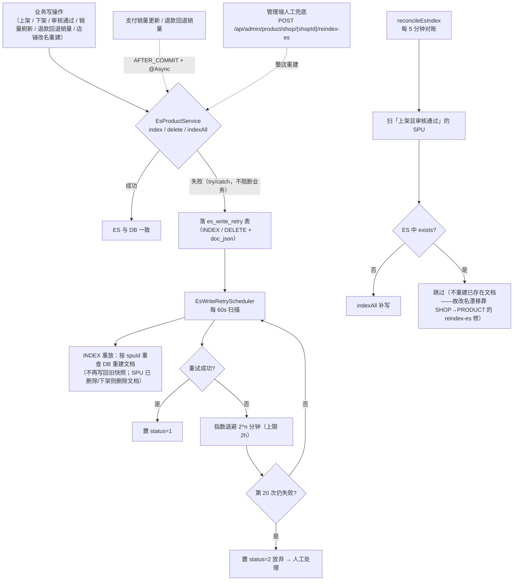
```mermaid
flowchart TB
    W["业务写操作<br/>（上架 / 下架 / 审核通过 / 销量刷新 / 退款回退销量 / 店铺改名重建）"] --> TRY{"EsProductService<br/>index / delete / indexAll"}
    TRY -->|成功| OK["ES 与 DB 一致"]
    TRY -->|失败（try/catch，不阻断业务）| RETRY["落 es_write_retry 表<br/>（INDEX / DELETE + doc_json）"]

    RETRY --> SCHED["EsWriteRetryScheduler<br/>每 60s 扫描"]
    SCHED --> RELOAD["INDEX 重放：按 spuId 重查 DB 重建文档<br/>（不再写回旧快照；SPU 已删除/下架则删除文档）"]
    SCHED --> R{"重试成功?"}
    R -->|是| DONE["置 status=1"]
    R -->|否| BACK["指数退避 2^n 分钟（上限 2h）"]
    BACK --> CNT{"第 20 次仍失败?"}
    CNT -->|是| GIVEUP["置 status=2 放弃 → 人工处理"]
    CNT -->|否| SCHED

    REC["reconcileEsIndex<br/>每 5 分钟对账"] --> SCAN2["扫「上架且审核通过」的 SPU"]
    SCAN2 --> EX{"ES 中 exists?"}
    EX -->|否| FIX["indexAll 补写"]
    EX -->|是| SKIP["跳过（不重建已存在文档——故改名漂移靠 SHOP→PRODUCT 的 reindex-es 修）"]

    SALE["支付销量更新 / 退款回退销量"] -.->|"AFTER_COMMIT + @Async"| TRY
    ADMIN["管理端人工兜底<br/>POST /api/admin/product/shop/{shopId}/reindex-es"] -.->|"整店重建"| TRY
```

> 分工：**补偿表**兜「写的那一刻失败」，**对账任务**兜「事后缺失/被清空」（只补缺失，不重建已存在文档），
> **改名重建**兜「店名快照漂移」，**管理端入口**兜「以上都没修好时的人工重试」，**异步事件**让销量刷新不占支付事务与 SPU 行锁。
> 说明：`EsWriteRetryScheduler` 重放与 `reconcileEsIndex` 都以 DB 为真源**重查重建**，不再写回失败当时的旧快照
> （旧快照会把过期的销量/店名覆盖回 ES）。

---

## 13. 订单超时关单（双保险）

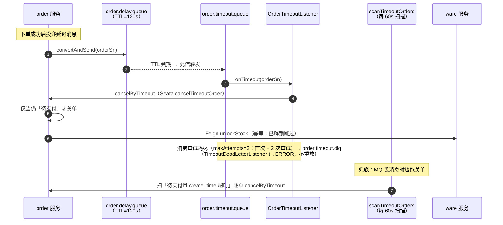
```mermaid
sequenceDiagram
    autonumber
    participant O as order 服务
    participant DQ as order.delay.queue<br/>（TTL=120s）
    participant TQ as order.timeout.queue
    participant L as OrderTimeoutListener
    participant SCAN as scanTimeoutOrders<br/>（每 60s 扫描）
    participant W as ware 服务

    Note over O: 下单成功后投递延迟消息
    O->>DQ: convertAndSend(orderSn)
    DQ-->>TQ: TTL 到期 → 死信转发
    TQ->>L: onTimeout(orderSn)
    L->>O: cancelByTimeout（Seata cancelTimeoutOrder）
    O->>O: 仅当仍「待支付」才关单
    O->>W: Feign unlockStock（幂等：已解锁跳过）
    Note over L,TQ: 消费重试耗尽（maxAttempts=3：首次 + 2 次重试）→ order.timeout.dlq<br/>（TimeoutDeadLetterListener 记 ERROR，不重放）

    Note over SCAN: 兜底：MQ 丢消息时也能关单
    SCAN->>O: 扫「待支付且 create_time 超时」逐单 cancelByTimeout
```

---

## 14. 聊天链路时序（STOMP）

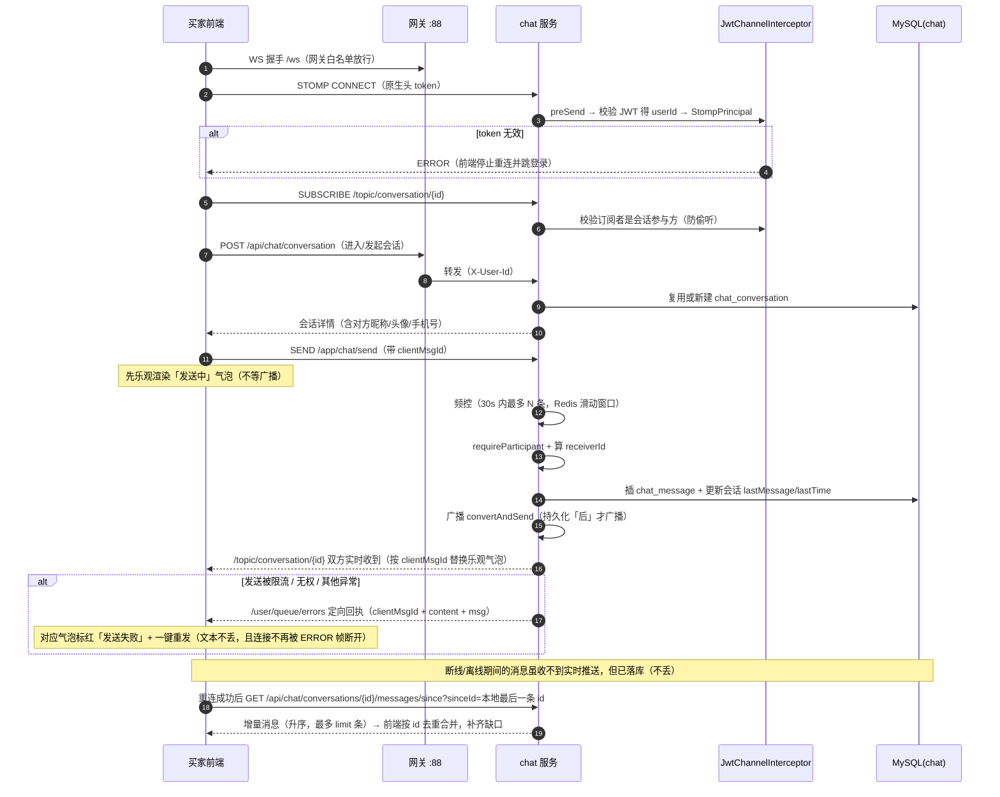
```mermaid
sequenceDiagram
    autonumber
    participant BUY as 买家前端
    participant GW as 网关 :88
    participant CH as chat 服务
    participant INT as JwtChannelInterceptor
    participant DB as MySQL(chat)

    BUY->>GW: WS 握手 /ws（网关白名单放行）
    BUY->>CH: STOMP CONNECT（原生头 token）
    CH->>INT: preSend → 校验 JWT 得 userId → StompPrincipal
    alt token 无效
        INT-->>BUY: ERROR（前端停止重连并跳登录）
    end
    BUY->>CH: SUBSCRIBE /topic/conversation/{id}
    CH->>INT: 校验订阅者是会话参与方（防偷听）
    BUY->>GW: POST /api/chat/conversation（进入/发起会话）
    GW->>CH: 转发（X-User-Id）
    CH->>DB: 复用或新建 chat_conversation
    CH-->>BUY: 会话详情（含对方昵称/头像/手机号）

    BUY->>CH: SEND /app/chat/send（带 clientMsgId）
    Note over BUY: 先乐观渲染「发送中」气泡（不等广播）
    CH->>CH: 频控（30s 内最多 N 条，Redis 滑动窗口）
    CH->>CH: requireParticipant + 算 receiverId
    CH->>DB: 插 chat_message + 更新会话 lastMessage/lastTime
    CH->>CH: 广播 convertAndSend（持久化「后」才广播）
    CH-->>BUY: /topic/conversation/{id} 双方实时收到（按 clientMsgId 替换乐观气泡）
    alt 发送被限流 / 无权 / 其他异常
        CH-->>BUY: /user/queue/errors 定向回执（clientMsgId + content + msg）
        Note over BUY: 对应气泡标红「发送失败」+ 一键重发（文本不丢，且连接不再被 ERROR 帧断开）
    end

    Note over BUY,DB: 断线/离线期间的消息虽收不到实时推送，但已落库（不丢）
    BUY->>CH: 重连成功后 GET /api/chat/conversations/{id}/messages/since?sinceId=本地最后一条 id
    CH-->>BUY: 增量消息（升序，最多 limit 条）→ 前端按 id 去重合并，补齐缺口
```

---

## 15. Agent 浮窗链路时序（SSE）

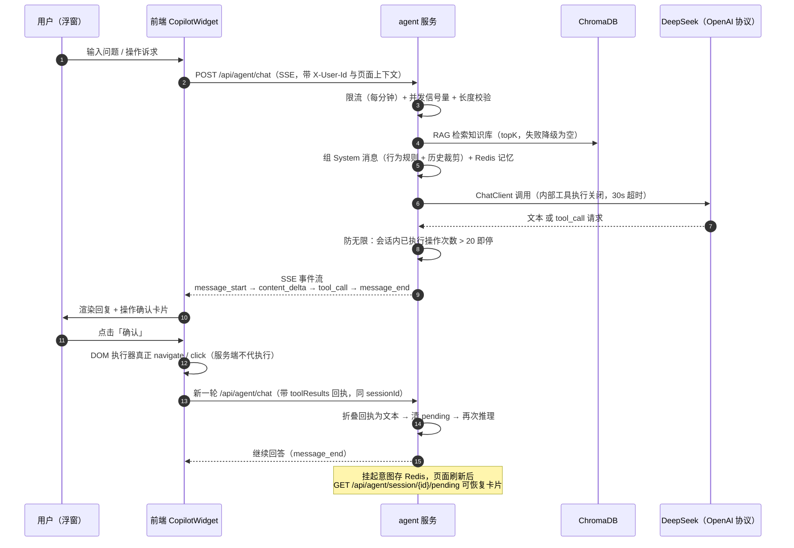
```mermaid
sequenceDiagram
    autonumber
    participant U as 用户（浮窗）
    participant FE as 前端 CopilotWidget
    participant AG as agent 服务
    participant KB as ChromaDB
    participant LLM as DeepSeek（OpenAI 协议）

    U->>FE: 输入问题 / 操作诉求
    FE->>AG: POST /api/agent/chat（SSE，带 X-User-Id 与页面上下文）
    AG->>AG: 限流（每分钟）+ 并发信号量 + 长度校验
    AG->>KB: RAG 检索知识库（topK，失败降级为空）
    AG->>AG: 组 System 消息（行为规则 + 历史裁剪）+ Redis 记忆
    AG->>LLM: ChatClient 调用（内部工具执行关闭，30s 超时）
    LLM-->>AG: 文本 或 tool_call 请求
    AG->>AG: 防无限：会话内已执行操作次数 > 20 即停
    AG-->>FE: SSE 事件流<br/>message_start → content_delta → tool_call → message_end
    FE->>U: 渲染回复 + 操作确认卡片

    U->>FE: 点击「确认」
    FE->>FE: DOM 执行器真正 navigate / click（服务端不代执行）
    FE->>AG: 新一轮 /api/agent/chat（带 toolResults 回执，同 sessionId）
    AG->>AG: 折叠回执为文本 → 清 pending → 再次推理
    AG-->>FE: 继续回答（message_end）
    Note over AG: 挂起意图存 Redis，页面刷新后<br/>GET /api/agent/session/{id}/pending 可恢复卡片
```

---

## 16. 数据库 ER 关系

> 六套独立库（auth / shop / product / order / ware / chat），**无跨库外键**，跨库一致性由 Feign + Seata 或 MQ 保证。
> 主键均为雪花 ID（`ASSIGN_ID`）；仅 Outbox 与流水等内部日志表保留自增。

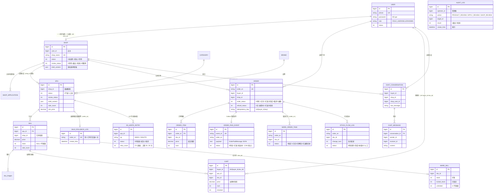
```mermaid
erDiagram
    USER ||--o| SHOP : "一个用户最多一个店铺（UK user_id）"
    SHOP ||--o{ SHOP_APPLICATION : "入驻申请留痕"
    SHOP ||--o{ SPU : "店铺商品（shop_id 隔离）"
    SPU ||--o{ SKU : "包含"
    SKU ||--o{ sku_images : "图片"
    CATEGORY ||--o{ SPU : "类目"
    BRAND ||--o{ SPU : "品牌"
    SPU ||--o| SALE_ROLLBACK_LOG : "退款销量回退幂等（order_sn）"

    USER ||--o{ ORDER : "买家下单"
    SHOP ||--o{ ORDER : "卖家订单"
    ORDER ||--o{ ORDER_ITEM : "订单明细"
    ORDER ||--o| ORDER_PAID_EVENT : "Outbox 待发事件"
    USER ||--o{ CART : "购物车（UK buyer_id+sku_id）"
    SKU ||--o{ CART : "加购的规格"

    SKU ||--o| WARE_SKU : "库存行（sku_id）"
    ORDER ||--o{ WARE_ORDER_TASK : "锁定任务（order_sn）"
    ORDER ||--o{ STOCK_FLOW_LOG : "扣减流水"
    SPU ||--o{ ES_WRITE_RETRY : "ES 写失败补偿"

    SHOP ||--o{ CHAT_CONVERSATION : "店铺会话"
    USER ||--o{ CHAT_CONVERSATION : "买家会话"
    CHAT_CONVERSATION ||--o{ CHAT_MESSAGE : "消息"

    USER {
        bigint id PK
        string phone UK
        string password "BCrypt"
        string role "ROLE_USER/SELLER/ADMIN"
        int status
    }
    SHOP {
        bigint id PK
        bigint user_id "店主"
        string shop_name UK
        int status "0未启用 1营业 2禁用"
        int review_status "0待审 1通过 2拒绝 3待重审"
        json draft_content "宽松重审草稿"
    }
    SPU {
        bigint id PK
        bigint shop_id "数据隔离"
        int status "0下架 1上架"
        int review_status
        json draft_content
        int sale_count
        decimal min_price
    }
    SKU {
        bigint id PK
        bigint spu_id FK
        bigint shop_id "冗余隔离"
        decimal price
        int stock "NULL=不限量"
        int sale_count
    }
    ORDER {
        bigint id PK
        string order_sn UK
        bigint buyer_id
        bigint shop_id
        int order_status "0待付 1已付 2已发 3完成 4取消 5退款"
        int refund_status "0无 1退款中 2已退 3拒绝"
        string idempotency_key "UK(buyer_id,key)"
    }
    ORDER_ITEM {
        bigint id PK
        bigint order_id FK
        bigint sku_id
        decimal price "成交快照"
        int num
    }
    ORDER_PAID_EVENT {
        bigint id PK
        string event_id UK
        string order_sn
        text payload "OrderPaidMessage JSON"
        int status "0待发 1已发 2发送中（CAS 抢占）"
    }
    CART {
        bigint id PK
        bigint buyer_id "UK(buyer_id,sku_id)"
        bigint spu_id
        bigint sku_id
        decimal price "加购时快照"
        int num
        int checked
    }
    SALE_ROLLBACK_LOG {
        bigint id PK
        string order_sn UK "同一订单只回退一次"
        datetime create_time
    }
    ES_WRITE_RETRY {
        bigint id PK
        bigint spu_id
        string op "INDEX / DELETE"
        int status "0待重放 1成功 2放弃"
        int retry_count "2^n 退避，上限 2h / 20 次"
    }
    AUDIT_LOG {
        bigint id PK
        bigint operator_id "管理员"
        string action "PRODUCT_REVIEW / APPLY_REVIEW / SHOP_REVIEW"
        bigint target_id
        int result "1通过 0拒绝"
        datetime create_time "索引"
    }
    WARE_SKU {
        bigint id PK
        bigint sku_id
        int stock "可售"
        int locked_stock "已锁定"
        int unlimited "1=不限量"
    }
    WARE_ORDER_TASK {
        bigint id PK
        string order_sn
        bigint sku_id
        int status "0锁定 1已扣 2已解锁 3已退款回补"
    }
    STOCK_FLOW_LOG {
        bigint id PK
        string order_sn
        bigint sku_id
        int change_num "负向扣减"
        int status "0待处理 1完成 2补偿中 3人工"
    }
    CHAT_CONVERSATION {
        bigint id PK
        bigint buyer_id
        bigint shop_id
        bigint shop_user_id
        string last_message
    }
    CHAT_MESSAGE {
        bigint id PK
        bigint conversation_id FK
        bigint sender_id
        bigint receiver_id
        string content
    }
```

---

## 附：HTTP 接口前缀 → 服务 对照

| 前缀 | 目标服务 | 是否需登录 |
|---|---|---|
| `/api/auth/**` | lingmart-auth | 注册/登录/发码免登录，其余需登录 |
| `/api/shop/**` | lingmart-shop | `storefront/**`、`list` 免登录，其余需登录 |
| `/api/product/**` | lingmart-product | 需登录（详情对非属主按可见性门控） |
| `/api/order/**`、`/api/cart/**` | lingmart-order | 需登录 |
| `/api/ware/**` | lingmart-ware | 需登录 |
| `/api/search/**` | lingmart-search | 免登录 |
| `/api/chat/**`、`/ws/**` | lingmart-chat | REST 需登录；WS 由 STOMP CONNECT 校验 |
| `/api/agent/**` | lingmart-agent | 需登录（X-User-Id 缺失时降级匿名会话） |
| `/api/admin/**` | auth / shop / product | 需 ROLE_ADMIN |
| `/uploads/**` | lingmart-shop（静态资源） | 免登录 |
| `/internal/**` | 各服务 | 不经网关，仅服务间 Feign |
